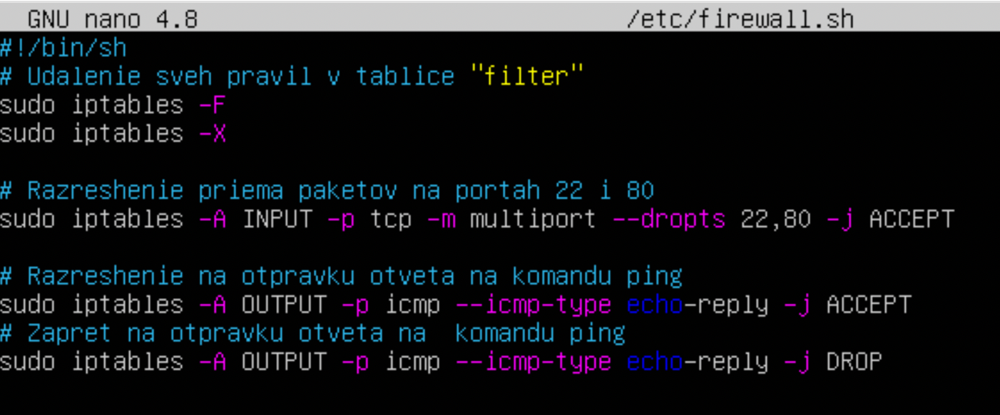
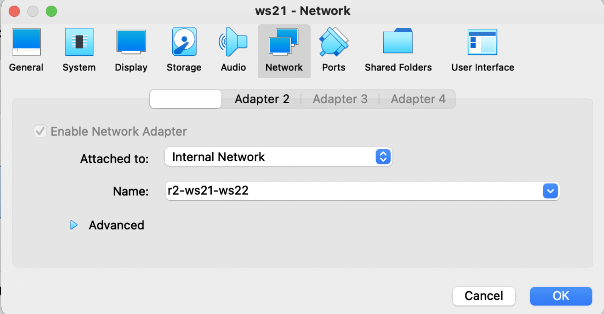
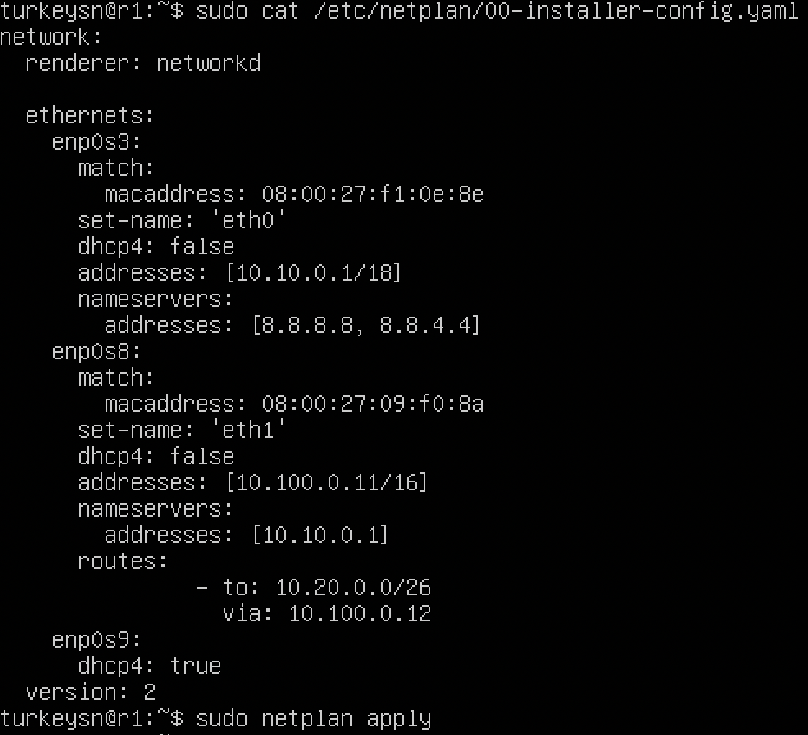
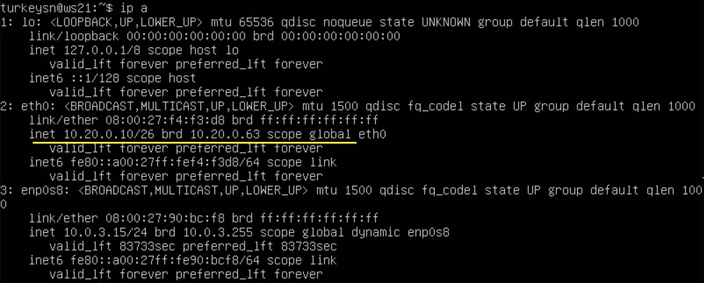
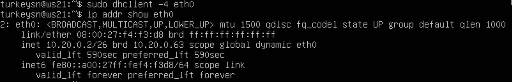
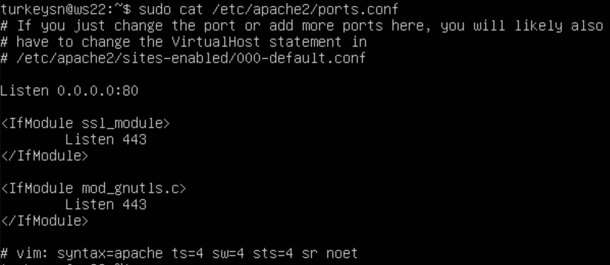
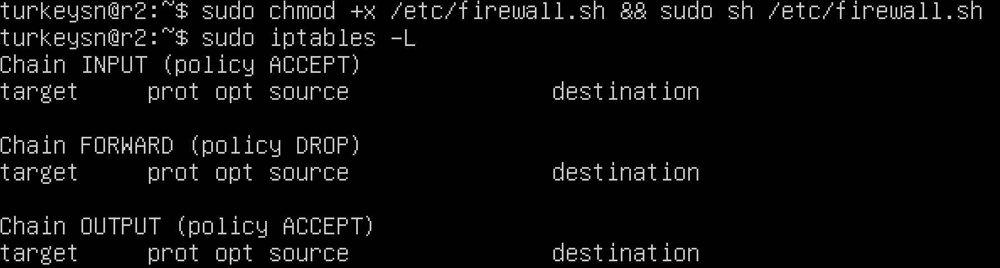

## Сети в Linux.

## Contents
- [Сети в Linux.](#сети-в-linux)
- [Contents](#contents)
- [Part 1. Инструмент ipcalc.](#part-1-инструмент-ipcalc)
- [Part 2. Статическая маршрутизация между двумя машинами.](#part-2-статическая-маршрутизация-между-двумя-машинами)
- [Part 3. Утилита iperf3.](#part-3-утилита-iperf3)
- [Part 4. Сетевой экран.](#part-4-сетевой-экран)
- [Part 5. Статическая маршрутизация сети.](#part-5-статическая-маршрутизация-сети)
  - [5.1. Настройка адресов машин:](#51-настройка-адресов-машин)
  - [5.2. Включение переадресации IP-адресов:](#52-включение-переадресации-ip-адресов)
  - [5.3. Установка маршрута по-умолчанию:](#53-установка-маршрута-по-умолчанию)
  - [5.4. Добавление статических маршрутов:](#54-добавление-статических-маршрутов)
  - [5.5. Построение списка маршрутизаторов:](#55-построение-списка-маршрутизаторов)
  - [5.6. Использование протокола ICMP при маршрутизации:](#56-использование-протокола-icmp-при-маршрутизации)
- [Part 6. Динамическая настройка IP с помощью DHCP:](#part-6-динамическая-настройка-ip-с-помощью-dhcp)
    - [1. У казать адрес маршрутизатора по-умолчанию, DNS-сервер и адрес внутренней сети.](#1-у-казать-адрес-маршрутизатора-по-умолчанию-dns-сервер-и-адрес-внутренней-сети)
    - [2. В файле resolv.conf прописать nameserver 8.8.8.8.](#2-в-файле-resolvconf-прописать-nameserver-8888)
- [Part 7. NAT:](#part-7-nat)
- [Part 8. Дополнительно. Знакомство с SSH Tunnels:](#part-8-дополнительно-знакомство-с-ssh-tunnels)

**Скачиваем `iso` образ для выполнения заданий и создания виртуальных машин (далее VM): ws11, ws21, r1, r2, ws22. ubuntu-20.04-live-server.**

## Part 1. Инструмент ipcalc.

1.1. Сети и маски:

1. Адрес сети *192.167.38.54/13: 192.160.0.0/13*  

1. Перевод маски *255.255.255.0* в префискную и двоичную запись:
* CIDR: /24
* Mask: 255.255.255.0
* Binary mask: 11111111.11111111.11111111.00000000  

   Перевод маски */15* в обычную и двоичную запись:
* CIDR: /15
* Mask: 255.254.0.0
* Binary mask: 11111111.11111110.00000000.00000000  

   Перевод маски *11111111.11111111.11111111.11110000* в обычную и двоичную запись
* CIDR: /28
* Mask: 255.255.255.240
* Binary mask: 11111111.11111111.11111111.11110000  

1. MIN host: *12.0.0.1* MAX host: *12.255.255.254*  

   MIN host: *12.167.0.1* MAX host: *12.167.255.254*  

   MIN host: *12.167.38.1* MAX host: *12.167.39.254*  

   MIN host: *0.0.0.1* MAX host: *15.255.255.254*  

1.2. localhost:

* Можно обратиться к приложению с IP: 127.0.0.2/24, 127.1.0.1/8

* Нельзя обратиться к приложению с IP: 194.34.23.100, 128.0.0.1

Адрес 194.34.23.100, вероятно, является публичным IP-адресом, и он не сможет обратиться к вашему localhost, так как localhost доступен только на вашем локальном компьютере. 128.0.0.1 являются частью диапазона адресов, зарезервированных для использования в качестве loopback-адресов. Однако они обычно не используются для общего доступа к localhost, поскольку это может привести к конфликтам.

*Частный IP-адрес (англ. private IP address), также называемый внутренним, внутрисетевым или локальным — IP-адрес, принадлежащий к специальному диапазону, не используемому в сети Интернет. Такие адреса предназначены для применения в локальных сетях, распределение таких адресов никем не контролируется. В связи с дефицитом свободных IP-адресов провайдеры всё чаще раздают своим абонентам именно внутрисетевые адреса, а не внешние, при этом они все выходят в интернет через один внешний IP (так называемый «белый IP»).*

*Иногда частные адреса называют неанонсированными, внешние (так называемые «белые IP») — анонсированными.*

*Частные диапазоны IP-адресов. Следующие диапазоны определены IANA как адреса, выделенные **локальным** сетям IPv4: **10**.0.0.0 — 10.255.255.255 (маска подсети для бесклассовой (CIDR) адресации: 255.0.0.0 или /8) **100.64**.0.0 — **100.127**.255.255 (маска подсети 255.192.0.0 или /10) — Данная подсеть рекомендована согласно RFC 6598 для использования в качестве адресов для CGN (Carrier-Grade NAT). **172.16**.0.0 — **172.31**.255.255 (маска подсети: 255.240.0.0 или /12) **192.168**.0.0 — 192.168.255.255 (маска подсети: 255.255.0.0 или /16) Также для **петлевых** интерфейсов (**не используется для** обмена между узлами сети) зарезервирован диапазон **127**.0.0.0 — 127.255.255.255 (маска подсети: 255.0.0.0 или /8).*

1.3. Диапазоны и сегменты сетей:

IP бывают белые и серые (или публичные и частные). Публичным IP адресом называется IP адрес, который используется для выхода в Интернет. Адреса, используемые в локальных сетях, относят к частным. Частные IP не маршрутизируются в Интернете.

Публичные адреса назначаются публичным веб-серверам для того, чтобы человек смог попасть на этот сервер, вне зависимости от его местоположения, то есть через Интернет. Например, игровые сервера являются публичными, как и сервера Хабра и многих других веб-ресурсов.
Большое отличие частных и публичных IP адресов заключается в том, что используя частный IP адрес мы можем назначить компьютеру любой номер (главное, чтобы не было совпадающих номеров), а с публичными адресами всё не так просто. Выдача публичных адресов контролируется различными организациями.

Допустим, Вы молодой сетевой инженер и хотите дать доступ к своему серверу всем пользователям Интернета. Для этого Вам нужно получить публичный IP адрес. Чтобы его получить Вы обращаетесь к своему интернет провайдеру, и он выдаёт Вам публичный IP адрес, но из рукава он его взять не может, поэтому он обращается к локальному Интернет регистратору (LIR – Local Internet Registry), который выдаёт пачку IP адресов Вашему провайдеру, а провайдер из этой пачки выдаёт Вам один адрес. Локальный Интернет регистратор не может выдать пачку адресов из неоткуда, поэтому он обращается к региональному Интернет регистратору (RIR – Regional Internet Registry). В свою очередь региональный Интернет регистратор обращается к международной некоммерческой организации IANA (Internet Assigned Numbers Authority). Контролирует действие организации IANA компания ICANN (Internet Corporation for Assigned Names and Numbers). Такой сложный процесс необходим для того, чтобы не было путаницы в публичных IP адресах.

Поскольку мы занимаемся созданием локальных вычислительных сетей (LAN — Local Area Network), мы будем пользоваться именно частными IP адресами. Для работы с ними необходимо понимать какие адреса частные, а какие нет. В таблице ниже приведены частные IP адреса, которыми мы и будем пользоваться при построении сетей.

1. Какие из перечисленных IP можно использовать в качестве публичного, а какие только в качестве частных: 10.0.0.45/8, 134.43.0.2/16, 192.168.4.2/16, 172.20.250.4/12, 172.0.2.1/12, 192.172.0.1/12, 172.68.0.2/12, 172.16.255.255/12, 10.10.10.10/8, 192.169.168.1/16
            
        частные:
            10.0.0.45/8
            192.168.4.2/16
            172.20.250.4/12
            172.16.255.255/12
            10.10.10.10/8
            
        публичные:
            134.43.0.2/16
            172.0.2.1/12
            192.172.0.1/12 (частично частный, привелегированный)
            172.68.0.2/12
            192.169.168.1/16

2. какие из перечисленных IP адресов шлюза возможны у сети 10.10.0.0/18: 10.0.0.1, 10.10.0.2, 10.10.10.10, 10.10.100.1, 10.10.1.255
         
            10.10.0.2
            10.10.10.10
            10.10.1.255

## Part 2. Статическая маршрутизация между двумя машинами.

**Далее слева **ws1**, справа **ws2**.**

* Смотрим существующие сетевые интерфейсы с помощью команды `ip a`:

* Чтобы иметь возможность одновременно подключиться к внешней и локальной сети, а так же работать с виртуальной машиной через терминал ПК создаём дополнительный сетевой интерфейс (адаптер) для локальной виртуальной сети:

* Изменения в сетевые интерфейсы вносим с помощью `mcedit или vim /etc/netplan/00-installer-config.yaml`. Вывод содержания измененного файла `cat /etc/netplan/00-installer-config.yaml` для каждой машины и вызов команды `sudo netplan apply` для перезапуска сервиса сети:

1. Добавление статического маршрута вручную:
* Добавим статистический маршрут при помощи команды `sudo ip r add` и пропингуем `ping -c` соединение между машинами:
* **Важная заметка:** Если Вы не создали в Virtual Box по инструкции выше и не прописали в файле *.yaml второй сетевой интерфейс (адаптер), а только лишь изменили первый (enp0s3), то возможно при выполнении данной команды у вас возникнет ошибка **Destination host unreachable**. Решение проблемы для одного сетевого интерфейса: Devices > Network > Network Settings... Там по умолчанию будет NAT, смените на Bridged adapter и нажмите OK. 

1. Добавление статического маршрута с сохранением:
* Изменения вносим с помощью `vim /etc/netplan/00-installer-config.yaml`. Добавим статический маршрут от одной машины до другой с помощью файла `cat /etc/netplan/00-installer-config.yaml`, перезапустим сервер сети и пропингуем соединение между машинами:

## Part 3. Утилита iperf3.

3.1. Скорость соединения:

* 8 Mbps = 1 MB/s
* 100 MB/s = 800000 Kbps
* 1 Gbps = 1000 Mbps

3.2. Утилита iperf3:
* Выполняем команды на ws1 - `sudo iperf3 -s` и на ws 2 - `sudo iperf3 -c 192.168.100.10` 

## Part 4. Сетевой экран.

4.1. Утилита iptables:

* Создаем файлы `sudo vim /etc/firewall.sh`

* Запуск файлов на обеих машинах командами `sudo chmod +x /etc/firewall.sh` и `sudo sh /etc/firewall.sh`

4.2. Утилита nmap:

* Командой ping находим машину, которая не "пингуется", после чего утилитой nmap показываем, что хост машины запущен

* ws1 - OUTPUT для пакетов на ping-reply DROP - не работает т.е. пакеты отправляет, но не принемает.
* ws2 - OUTPUT для пакетов на ping-reply ACCEPT - работает.

**Сохранить дампы образов виртуальных машин. Инструкция в начале**

## Part 5. Статическая маршрутизация сети.

**В данном задании создайте 5 новых виртуальных машин. Можно взять iso образ виртуальной машины Ubuntu Server 20.04 по ссылке в начале и установить его в Virtual Box. Для ускорения процесса создания сети, можно клонировать виртуальные машины из образа машины, обновленной до последней версии как показано ниже:**

### 5.1. Настройка адресов машин:

* Сеть:

* Вносим изменения для каждой из машин в Oracle VM VirtualBox Manager: 
  * Для **r1**, Settings > Network > Adapter 1 (Internal Network, r1-ws11), Adapter 2 (Internal Network, r1-r2), Adapter 3 (NAT)
  * Для **r2**: Settings > Network > Adapter 1 (Internal Network, r1-r2), Adapter 2 (Internal Network, r2-ws21-ws22), Adapter 3 (NAT)
  * Для **ws11**, Settings > Network > Adapter 1 (Internal Network, r1-ws11), Adapter 2 (NAT)
  * Для **ws21, ws22**:  Settings > Network > Adapter 1 (Internal Network, r2-ws21-ws22), Adapter 2 (NAT)

* и перезапустить сервис сети командой `sudo netplan apply` 2 роутера (r1, r2):

* 3 рабочие станции (ws11, ws22, ws21):

* Выполнить команду `ip -4 a` для каждой машины:
* 2 роутера (r1, r2):

* 3 рабочие станции (ws11, ws22, ws21):

* Пропингуйте ping ws22 с ws21 и ping r1 с ws11:

### 5.2. Включение переадресации IP-адресов:

* Для включения переадресации IP, выполните команду на роутерах(r1, r2): `sudo sysctl -w net.ipv4.ip_forward=1`

* Откройте на роутерах файл `sudo nano /etc/sysctl.conf` и добавьте в него следующую строку: **net.ipv4.ip_forward = 1**

### 5.3. Установка маршрута по-умолчанию:

* Настроика маршрута по-умолчанию (шлюз) для рабочих станций(ws11, ws22, ws21):
* Вносим изменения для каждой из машин `sudo nano /etc/netplan/00-installer-config.yaml`

* Вызвать ip r и проверяем, добавился ли маршрут в таблицу маршрутизации:

* Пропингуем ws11 - r2; `sudo tcpdump -tn -i eth0`

ошибка при отсутствии соответствующих правил маршрутизации в файлах конфигураций .yaml роутеров r1 и r2 невозможен трафик, и, соответственно, захват пакетов на интерфейсах, смотрящих в локальные подсети этих роутеров, отправленных с устройств этих подсетей, в локальную подсеть соседнего роутера.

* Пропингуем ws11 - r2; `sudo tcpdump -tn -i eth0` После добавления маршрутов, получаем:

### 5.4. Добавление статических маршрутов:

* Добавить в роутеры r1 и r2 статические маршруты в файле конфигураций.

* Вызвать ip r и показать таблицы с маршрутами на обоих роутерах.

* Запустить команды на ws11: `ip r list 10.10.0.0/[маска сети] и ip r list 0.0.0.0/0`

* Для адреса `10.10.0.0/[маска сети]` был выбран маршрут, отличный от `0.0.0.0/0`, потому что маска `/18` описывает маршрут к сети точнее, в отличие от маски `/0`.

Классические правила маршрутизации (М.) всегда ориентированы на IP-адрес назначения `dst_ip`, то есть куда адресован пакет.

После определения `dst_ip` процесс М. по определённому алгоритму сопоставляет правила таблицы маршрутизации (ТМ) с определённым `dst_ip`, подбирая соответствующее ему правило М.

При сопоставлении за основу принимается маска подсети (netmask). Если `dst_ip` входит в адресный диапазон сетевого интерфейса роутера, указанного в правиле ТМ, тогда пакеты трафика направляются на IP-адрес данного сетевого интерфейса роутера.

В то время как маршрут по умолчанию `default` имеет согласно этого алгоритма сопоставления самый низкий приоритет из всех возможных. Он применяется при выборе маршрута в случае соответствия `dst_ip` сразу нескольким сетевым интерфейсам ТМ, либо при его несоответствии ни одному из других правил в ТМ.

При настройке сетевого интерфейса прописывается 3 параметра: `IP-адрес`, `netmask`, IP-адрес основного шлюза `gateway`. Именно эти параметры принимаются ТМ, при этом создаётся новая запись (правило).

Рассмотрим пошагово как происходит определение маршрута на третьем уровне модели `OSI` при формировании заголовка `L3` в процессе М. после настройки сетевого интерфейса и сохранения правил М.:

1. При формировании пакета в заголовок 3 уровня (`L3`, модели `OSI`) передаётся известный изначально `dst_ip`.
2. dst_ip сопоставляется с IP-адресом сети, указанным в правилах (записях) ТМ в соответствии с приоритетом правила (является одним из параметров ТМ).
Для этого `netmask` применяется (накладывается) к `dst_ip` с помощью побитового И `AND`.
Затем, полученный резултьтат сложения `dst_ip` и `netmask` сетевого IP-адреса сетевого интерфейса роутера сопоставляется с IP-адресом сети.
Если `dst_ip` соответствует IP-адресу сети, после применения к нему маски сети, то данное правило применяется для М. пакетов трафика данного `dst_ip`.
Если не соответствует, то происходит сопоставление следующего по приоритету правила из ТМ.
Если соответствующее правило в ТМ не найдено, то применяется правило (маршрут) по умолчанию `default`, созданное пользователем при (администратором сети) при настройке сетевого подключения через интерфейс пользователя `UI`. В поле основной шлюз `gateway` указывается IP-адрес соответствующего основного шлюза (интерфейса маршрутизатора).
При этом в ТМ в колонках (столбцах) "Сетевой адрес `Network Address`" и "Маска подсети `Netmask`" автоматически присваивается значение: `0.0.0.0`
В колонке "Интерфейс `Interface`" присваивается значение IP-адреса из поля "Основной шлюз `gateway`" `UI`.
Таким образом, при сопоставлении любого `dst_ip` с сетевым IP-адресом: `0.0.0.0`, после наложения на dst_ip маски сети `0.0.0.0`, этот `dst_ip` "обнуляется" и соответствует сетевому адресу: `0.0.0.0` То есть, к нему применяется маршрут по умолчанию `default`.
3. После завершения М. становится известен IP-адрес назначения `srs_ip` заголовка 3 уровня (L3). Он соответствует IP-адресу сетевого интерфейса роутера, указанного в колонке `Interface` строки маршрута в ТМ, определённой при М.

Таким образом, для адреса `10.10.0.0/18` был выбран маршрут, отличный от `0.0.0.0/0` в соответствии с приоритетом, установленным процессом маршрутизации, согласно которому маршрут: `10.10.0.0/18 dev eth0 proto kernel scope link src 10.10.0.2` имеет более высокий уровень приоритета в сравнении с маршрутом по умолчанию: `default via 10.10.0.1 dev eth0 proto static`.

### 5.5. Построение списка маршрутизаторов:

* Запустить на r1 команду дампа: `tcpdump -tnv -i eth0` 
* При помощи утилиты traceroute построить список маршрутизаторов на пути от ws11 до ws21: `traceroute [адрес сети]`

* Принцип работы traceroute:

Для определения промежуточных маршрутизаторов traceroute отправляет серию пакетов данных целевому узлу, при этом каждый раз увеличивая на 1 значение поля TTL («время жизни»). Это поле обычно указывает максимальное количество маршрутизаторов, которое может быть пройдено пакетом. Первый пакет отправляется с TTL, равным 1, и поэтому первый же маршрутизатор возвращает обратно сообщение ICMP, указывающее на невозможность доставки данных. Traceroute фиксирует адрес маршрутизатора, а также время между отправкой пакета и получением ответа (эти сведения выводятся на монитор компьютера). Затем traceroute повторяет отправку пакета, но уже с TTL, равным 2, что позволяет первому маршрутизатору пропустить пакет дальше.

Процесс повторяется до тех пор, пока при определённом значении TTL пакет не достигнет целевого узла. При получении ответа от этого узла процесс трассировки считается завершённым.

### 5.6. Использование протокола ICMP при маршрутизации:

* Запустить на r1 перехват сетевого трафика, проходящего через eth0 с помощью команды: `tcpdump -n -i eth0 icmp`
* Пропинговать с ws11 несуществующий IP (например, 10.30.0.111) с помощью команды: `ping -c 1 10.30.0.111`

**Сохранить дампы образов виртуальных машин. Инструкция в начале**

## Part 6. Динамическая настройка IP с помощью DHCP:

**В данном задании используются виртуальные машины из Части 5.**

* Для r2 настроить в файле /etc/dhcp/dhcpd.conf конфигурацию службы DHCP:
#### 1. У казать адрес маршрутизатора по-умолчанию, DNS-сервер и адрес внутренней сети.

#### 2. В файле resolv.conf прописать nameserver 8.8.8.8.

* Перезагрузить службу DHCP командой `systemctl restart isc-dhcp-server`. Машину ws21 перезагрузить при помощи `reboot` и через `ip a` показать, что она получила адрес. Также пропинговать ws22 с ws21.

* Пинг ws22 с ws21.  

* Указать MAC адрес у ws11, для этого в `etc/netplan/00-installer-config.yaml` надо добавить строки: `macaddress: 10:10:10:10:10:BA, dhcp4: true`.  

* Для r1 настроить аналогично r2, но сделать выдачу адресов с жесткой привязкой к MAC-адресу (ws11). Провести аналогичные тесты: `sudo nano /etc/dhcp/dhcpd.conf` для машины r1

* Для r1 настроить аналогично r2, в файле `resolv.conf` прописать nameserver `8.8.8.8`.

* Перезагрузить службу DHCP командой `systemctl restart isc-dhcp-server`. Машину ws11 перезагрузить при помощи `reboot` и через `ip a` показать, что она получила адрес.

* Запросить с ws21 обновление ip адреса. **До**:

* Для отображения IP-адреса интерфейса eth0 можно использовать команду ip addr show eth0. Она покажет информацию о сетевом интерфейсе eth0, включая его IP-адрес. Если IP-адрес на интерфейсе не настроен, команда вернет пустой вывод для этого интерфейса.
* Сушествует множество способов (команд) запроса обновления ip адреса, вот некоторые из них:
* `sudo dhclient -v` - эта команда запускает DHCP-клиент на интерфейсе (например, eth0) с подробным выводом (-v), пытаясь получить настройки с DHCP-сервера в сети. Если клиент успешно получает настройки, он настраивает соответствующий IP-адрес, маску подсети, шлюз и DNS-серверы для этого интерфейса.
* `sudo dhclient -r -v` - выполняет освобождение IP-адреса, полученного от DHCP-сервера, на указанном интерфейсе. Флаг -r указывает на освобождение IP-адреса, а -v запускает процесс в режиме подробного вывода.
Когда команда выполняется, DHCP-клиент отправляет запрос серверу DHCP с просьбой освободить ранее выданный IP-адрес. Если запрос принят сервером, то клиент получит подтверждение об освобождении адреса и удалит соответствующую запись из своей таблицы.

* `sudo dhclient -r eth0` - для обновления IP-адреса интерфейса с помощью команды dhclient можно использовать флаг -r, который предназначен для освобождения текущего IP-адреса и запуска процесса запроса нового адреса у DHCP-сервера. После этого можно запустить команду `dhclient` без каких-либо дополнительных флагов для получения нового IP-адреса от DHCP-сервера. Для отображения текущего IP-адреса интерфейса (например, eth0) при использовании команды sudo dhclient можно использовать флаг -4, который указывает на использование только протокола IPv4. Таким образом, полная команда будет выглядеть следующим образом: sudo `dhclient -4 eth0`. После выполнения этой команды в выводе будет указан текущий IP-адрес интерфейса eth0.
Ответ "RTNETLINK answers: File exists" означает, что в сетевой конфигурации уже существует запись для указанного интерфейса с таким же IP-адресом, какой попытался назначить DHCP-сервер.
Это может произойти, например, если был назначен статический IP-адрес на интерфейсе, и DHCP-сервер также попытался назначить ему другой IP-адрес.
В таком случае, можно попробовать сначала удалить статическую конфигурацию интерфейса, а затем повторить попытку получения IP-адреса от DHCP-сервера.

* Командой `ip addr del [ip-address/netmask] dev [interface]` можно удалить статическую конфигурацию интерфейса. Например, `sudo ip addr del 192.168.1.10/24 dev eth0`. После этого можно повторить команду `sudo dhclient -4 eth0`, чтобы получить IP-адрес от DHCP-сервера.

* Запросить с ws21 обновление ip адреса. **После**:

**Сохранить дампы образов виртуальных машин. Инструкция в начале**

## Part 7. NAT:

**В данном задании используются виртуальные машины из Части 5.**
1. ##### В файле /etc/apache2/ports.conf на ws22 и r1 изменить строку Listen 80 на Listen 0.0.0.0:80, то есть сделать сервер Apache2 общедоступным.

2. ##### Запустить веб-сервер Apache командой `service apache2 start` на ws22 и r1.

3. ##### Пропинговать r1 с ws22 чтобы убедиться, что пакеты проходят, связь есть: `ping -c 4 10.100.0.11`

4. ##### Добавить в фаервол, созданный по аналогии с фаерволом из Части 4, на r2 следующие правила:
* Удаление правил в таблице: `filter - iptables -F`
* Удаление правил в таблице "NAT": `iptables -F -t nat`
* Отбрасывать все маршрутизируемые пакеты: `iptables --policy FORWARD DROP`

* Запустить файл, предоставив соответствующие права доступа к нему: `sudo chmod +x /etc/firewall.sh && sudo sh /etc/firewall.sh`. Проверить список всех правил командой `sudo iptables -L`

* Пингуем ws22 и r1, пинг не проходит как и должно быть.

5. ##### Добавить в файл ещё одно правило в фаервол r2:
* Разрешить маршрутизацию всех пакетов протокола ICMP с помощью правила: `iptables -A FORVARD -p icmp -j ACCEPT`. Это правило iptables для цепочки FORWARD, которая отвечает за пересылку пакетов между интерфейсами на маршрутизаторе:
`sudo` - запуск команды с правами суперпользователя;
`iptables` - утилита для настройки правил межсетевого экрана;
`-A`: добавить правило в цепочку (append),
`FORWARD`: цепочка таблицы фильтрации `FORWARD`, которая обрабатывает пересылаемые пакеты,
`-p icmp` указывает, что данное правило относится к протоколу ICMP (Internet Control Message Protocol), который используется для отправки сообщений об ошибках и других уведомлений между устройствами в сети.
`-j ACCEPT` означает, что если пакет соответствует данному правилу, он будет принят (accepted) и перенаправлен на указанный в цепочке FORWARD интерфейс.
Таким образом, данное правило позволяет проходить пакетам протокола ICMP через маршрутизатор. Это может быть полезно, например, для проверки доступности устройств в сети или для отладки сетевых проблем.

* Запустить файл.  

* Пингуем ws22 и r1, пинг проходит.

1. ##### Добавить в файл ещё два правила в фаервол r2:
* Включить в фаервол (межсетевой экран) разрешение для трафика TCP пакетов с адресом назначения на 80 порт (destination port) с помощью команды `sudo iptables -A FORWARD -p tcp --dport 80 -j ACCEPT`.
Данное правило iptables в Linux Ubuntu Server 20.04 позволяет пропустить через межсетевой экран трафик TCP-пакетов с адресом назначения на порту 80 через межсетевой экран (firewall)
*Подробное описание параметров*:
`-A FORWARD` - добавление правила в цепочку FORWARD, отвечающую за пересылку пакетов между интерфейсами;
`-p tcp` - указание протокола, в данном случае TCP;
`--dport 80` - указание порта назначения, в данном случае 80 (стандартный порт HTTP);
Таким образом, данное правило позволяет пропустить TCP-трафик, направленный на порт 80, через межсетевой экран. Это может быть полезно, например, для разрешения доступа к веб-серверу, расположенному за межсетевым экраном, для пользователей внешней сети.
* Включить разрешение прохождения для трафика TCP пакетов через межсетевой экран с адресом источника на 80 порт (source port) с помощью команды `sudo iptables -A FORWARD -p tcp --sport 80 -j ACCEPT`. Отличие данного правила от предыдущего заключается в проверке порта источника (source port) в TCP-пакете:
`--sport 80`: определяет порт источника (source port) в TCP-пакете. В данном случае, это порт 80, который обычно используется для HTTP-запросов.
Предыдущее правило разрешает прохождение трафика на TCP-порту назначения (destination port), а данное правило разрешает прохождение трафика на TCP-порту источника (source port). Вместе они могут использоваться, например, для разрешения входящих и исходящих HTTP-запросов через межсетевой экран.
* Включить `SNAT`, а именно маскирование всех локальных ip из локальной сети, находящейся за r2 (по обозначениям из Части 5 - сеть `10.20.0.0`) с помощью правила настроек `NAT` для `POSTROUTING` цепочки в таблице `NAT`: `sudo iptables -t nat -A POSTROUTING -o eth0 -s 10.20.0.0/26 -j SNAT --to-source 10.100.0.12`.
*Описание параметров*:
`-t nat`: опция указывает таблицу nat, которая используется для настройки NAT.
`-A POSTROUTING`: опция указывает, что правило должно быть добавлено в цепочку POSTROUTING таблицы nat. POSTROUTING цепочка применяет правила к пакетам, которые покидают сервер и отправляются во внешнюю сеть.
`-o eth0`: опция указывает интерфейс, через который пакеты покидают сервер. В этом случае пакеты, которые покидают сервер, отправляются через интерфейс eth0.
`-s 10.20.0.0/26`: опция указывает исходный IP-адрес для пакетов, которые будут обработаны правилом. В этом случае пакеты с IP-адресами в диапазоне `10.20.0.0 до 10.20.0.63` будут обработаны правилом.
-j SNAT: опция указывает действие, которое будет выполнено, если пакет соответствует правилу. В этом случае действие SNAT используется для изменения исходного IP-адреса отправителя пакета.
`--to-source 10.100.0.12`: опция указывает IP-адрес, на который нужно изменить исходный адрес отправителя пакета. В этом случае исходный адрес отправителя пакета будет изменён на `10.100.0.12`.
Таким образом, данное правило изменяет исходный IP-адрес пакетов, проходящих через выходной интерфейс enp0s8, и имеющих исходный IP-адрес в диапазоне `10.20.0.0/26, на 10.100.0.12.`
Отличие от предыдущего правила (`sudo iptables -A FORWARD -p tcp --dport 80 -j ACCEPT`) заключается в том, что это правило настраивает NAT для изменения исходного IP-адреса отправителя пакетов, а не просто разрешает прохождение пакетов с определенным портом.

* Включить `DNAT` на `8080` порт машины `r2` и добавить к веб-серверу `Apache`, запущенному на `ws22`, доступ извне сети с помощью следующего правила настройки `DNAT`: `iptables -t nat -A PREROUTING -i eth0 -p tcp --dport 8080 -j DNAT --to-destination 10.20.0.20:80`.
Это правило iptables является правилом `NAT (Network Address Translation)` и определяет, что трафик, поступающий на сетевой интерфейс `eth0` с портом назначения `8080` и протоколом `TCP`, должен быть перенаправлен на IP-адрес `10.20.0.20` с портом назначения `80` (по умолчанию для HTTP). Ключевое слово `DNAT` означает, что происходит изменение адреса назначения (`Destination NAT`).
*Описание параметров*:
`-t nat`: устанавливает таблицу NAT, которая используется для изменения сетевых адресов.
`-A PREROUTING`: добавляет правило в цепочку `PREROUTING` таблицы `NAT`, которая обрабатывает входящий трафик до того, как он пройдет маршрутизацию.
`-i eth0`: задает интерфейс входящего трафика.
`-p tcp`: указывает протокол, которому принадлежит трафик.
`--dport 8080`: указывает порт назначения трафика.
`-j DNAT`: указывает, что нужно изменить адрес назначения пакета.
`--to-destination 10.20.0.20:80`: указывает новый адрес и порт, на который нужно перенаправить трафик.
Отличие от предыдущего правила заключается в том, что это правило применяется на входящий трафик (`PREROUTING`), тогда как предыдущее правило применяется на исходящий трафик (`POSTROUTING`). Также ключевое слово `DNAT` используется в этом правиле для изменения адреса назначения, в то время как в предыдущем правиле использовалось ключевое слово `SNAT` для изменения адреса источника.

* Запустить файл.  

**Перед тестированием рекомендуется отключить сетевой интерфейс NAT (его наличие можно проверить командой ip a) в VirtualBox, если он включен**

* Проверить соединение по TCP для SNAT, для этого с ws22 подключиться к серверу Apache на r1 командой: `sudo telnet 10.100.0.11 80`

* Проверить соединение по TCP для DNAT, для этого с r1 подключиться к серверу Apache на ws22 командой telnet (обращаться по адресу r2 и порту 8080):  

**Сохраненные дампы образов виртуальных машин**

